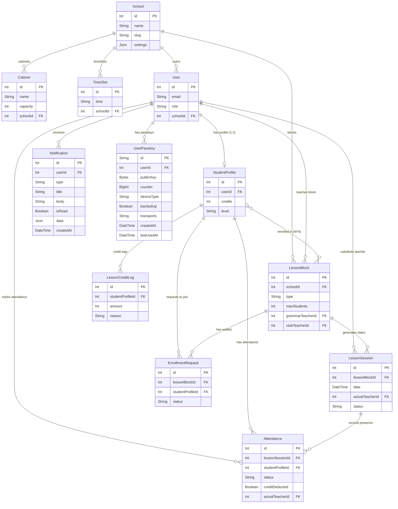

# Shamdan ER Diagram

```mermaid
erDiagram
    School {
        Int id PK
        String name
        String slug
        Json settings
    }
    Cabinet {
        Int id PK
        String name
        Int capacity
        Int schoolId FK
    }
    TimeSlot {
        Int id PK
        String time
        Int schoolId FK
    }
    User {
        Int id PK
        String email
        String role
        Int schoolId FK
    }
    StudentProfile {
        Int id PK
        Int userId FK
        Int credits
        String level
    }
    LessonBlock {
        Int id PK
        Int schoolId FK
        String type
        Int maxStudents
        Int grammarTeacherId FK
        Int clubTeacherId FK
    }
    LessonSession {
        Int id PK
        Int lessonBlockId FK
        DateTime date
        Int actualTeacherId FK
        String status
    }
    Attendance {
        Int id PK
        Int lessonSessionId FK
        Int studentProfileId FK
        String status
        Boolean creditDeducted
        Int actualTeacherId FK
    }
    LessonCreditLog {
        Int id PK
        Int studentProfileId FK
        Int amount
        String reason
    }
    EnrollmentRequest {
        Int id PK
        Int lessonBlockId FK
        Int studentProfileId FK
        String status
    }
    Notification {
        Int id PK
        Int userId FK
        String type
        String title
        String body
        Boolean isRead
        Json data
        DateTime createdAt
    }
    UserPasskey {
        String id PK
        Int userId FK
        Bytes publicKey
        BigInt counter
        String deviceType
        Boolean backedUp
        String transports
        DateTime createdAt
        DateTime lastUsedAt
    }

    School ||--o{ Cabinet : "cabinets"
    School ||--o{ TimeSlot : "timeSlots"
    School ||--o{ User : "users"
    School ||--o{ LessonBlock : "blocks"
    
    User ||--o| StudentProfile : "has profile (1:1)"
    User ||--o{ LessonBlock : "teaches block"
    User ||--o{ LessonSession : "substitute teacher"
    User ||--o{ Attendance : "marks attendance"
    User ||--o{ Notification : "receives"
    User ||--o{ UserPasskey : "has passkeys"

    StudentProfile }o--o{ LessonBlock : "enrolled in (M:N)"
    StudentProfile ||--o{ EnrollmentRequest : "requests to join"
    StudentProfile ||--o{ Attendance : "has attendance"
    StudentProfile ||--o{ LessonCreditLog : "credit logs"

    LessonBlock ||--o{ LessonSession : "generates dates"
    LessonBlock ||--o{ EnrollmentRequest : "has waitlist"
    
    LessonSession ||--o{ Attendance : "records presence"
```
